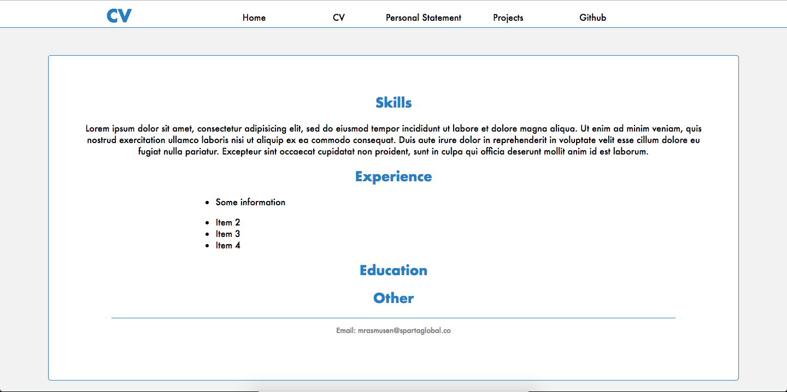

# Max's Personal Page

## Installation & Setup

Navigate to the desired location of the project and clone the repo with: 

```git clone https://github.com/maxrasmusen/personal-page```

Open ```index.html``` in a browser to view.

Edit with the text editor of your choice. 

## Project Summary

This is a website with some personal details, my CV and a few projects to display my skills and experience.

## Project Links

These are the same links that are linked in ```projects.html```: 

[Google](https://www.google.co.uk)

## Screnshots



## Technologies Learned
### Languages

* HTML
* CSS
* Ruby
* Javascript


